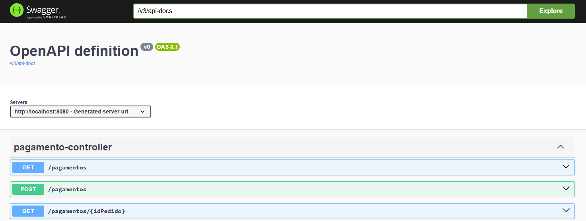
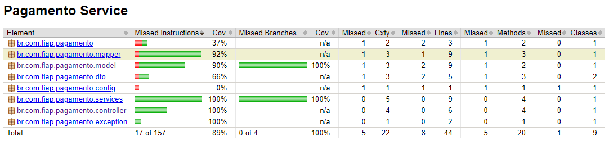

# PagamentoApplication

Este projeto é uma API REST desenvolvida com Spring Boot, MongoDB e testes com cobertura Jacoco. Ele simula o processamento de pagamentos, incluindo aprovação automática com base em regras simples.

---

## Tecnologias Utilizadas

- Java 21
- Spring Boot 3+
- Spring Data MongoDB
- MongoDB (Docker)
- Maven
- Jacoco (Cobertura de Testes)
- JUnit 5 / Mockito
- Docker / Docker Compose

---
## SWAGGER
A documentação da API está disponível em:

```http://localhost:8080/swagger-ui/index.html
```


## Funcionalidades

- `POST /pagamentos` — Processa um novo pagamento com base no valor.
- `GET /pagamentos/{idPedido}` — Consulta pagamento por ID do pedido.
- `GET /pagamentos` — Lista todos os pagamentos cadastrados.

---
## Exemplo de Requisição (POST /pagamentos)

```json
{
  "idPedido": "121",
  "idCartao": "123456",
  "valor": 99.00
}
```

 dataAprovacao` é preenchido automaticamente se não for enviado.

---

## Exemplo de Resposta

```json
{
  "idPedido": "121",
  "idCartao": "123456",
  "valor": 99.00,
  "status": "APROVADO",
  "dataAprovacao": "2025-05-20T19:15:59.117251500"
}
```

---

## Exemplo de Requisição GET

**Buscar pagamento por pedido:**

```
GET /pagamentos/121
```

**Resposta:**

```json
{
  "idPedido": "121",
  "idCartao": "123456",
  "valor": 99.00,
  "status": "APROVADO",
  "dataAprovacao": "2025-05-20T19:15:59.117251500"
}
```

---

## Exemplo de Lista de Pagamentos

```
GET /pagamentos
```

**Resposta:**

```json
[
  {
    "idPedido": "121",
    "idCartao": "123456",
    "valor": 99.00,
    "status": "APROVADO",
    "dataAprovacao": "2025-05-20T19:15:59.117251500"
  },
  {
    "idPedido": "122",
    "idCartao": "654321",
    "valor": 1800.00,
    "status": "RECUSADO",
    "dataAprovacao": "2025-05-20T19:16:45.001239200"
  }
]
```

## Regras de Negócio

- Pagamentos com valor **inferior a R$1500,00** são **aprovados automaticamente**.
- Os demais são **recusados**.
- Se `dataAprovacao` não for informada, o sistema preenche com a **data e hora atual**.

---

## Testes e Cobertura

- Os testes cobrem:
  - Serviço (`PagamentoService`)
  - Controller REST
  - Mapper
  - Exceptions

### Rodando testes com cobertura:
```bash
mvn clean verify
```

### Visualizar relatório:
Abra o arquivo:

```
target/site/jacoco/index.html
```

---

## Executando com Docker

**Subindo MongoDB via Docker:**

```bash
docker run -d -p 27017:27017 --name mongo mongo
```
**Subindo a aplicação:**

Ou via `docker-compose.yml` (adicione se necessário).

**Como rodar localmente:**

1. Instale o Java 21+ e o Maven
2. Rode o MongoDB local ou via Docker
3. Clone o repositório e execute:

```bash
mvn spring-boot:run
docker pull 1moninfernando/toy-store-apppag
```

A API ficará disponível em:

```
http://localhost:8080/pagamentos
```

---

## Estrutura do Projeto

```
src/
├── controller        # Endpoints REST
├── dto              # Objetos de entrada e saída
├── model            # Entidades do MongoDB
├── repository       # Interface para acesso a dados
├── services         # Lógica de negócios
├── mapper           # Conversões DTO <-> Model
└── exception        # Exceções personalizadas
```

---

## Autor

Desenvolvido por Fernando Monin — Projeto de Pós-Graduação FIAP - TECH CHALLENGE Fase 4

---
